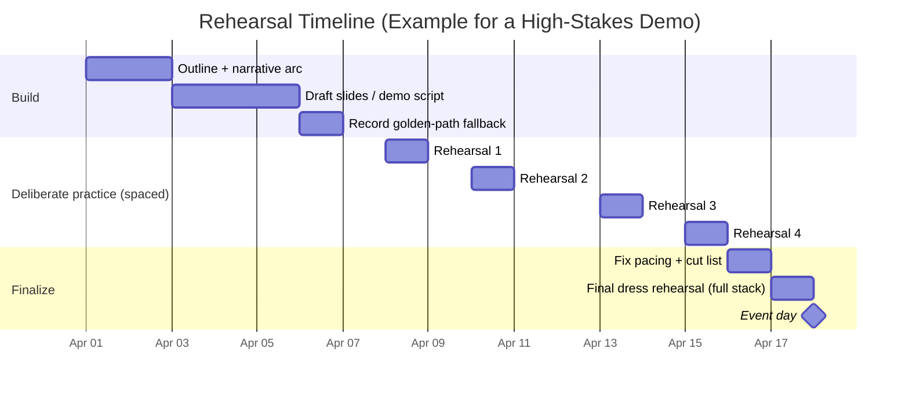

# Effective Presentations and Remote Codebase Demos

## Executive summary

Effective presentations are engineered around human cognitive constraints and social persuasion mechanisms, not “speaking talent.” Working memory is limited (classic evidence: Miller’s capacity limits) and is easily overwhelmed, especially when audiences must simultaneously read, listen, and orient themselves; slide and demo design should therefore reduce extraneous cognitive load and sequence information in manageable chunks. citeturn4search1turn0search5turn9search1

For visuals and screen-shares, the most evidence-supported design heuristics come from multimedia learning and cognitive load research: remove irrelevant detail (coherence / “seductive details”), explicitly cue what matters (signaling), avoid reading text that is already on-screen (redundancy), keep corresponding words and visuals close in space/time (contiguity), and break complex flows into segments (segmenting). citeturn7search0turn7search9turn8search7

Remote video-call demos add two high-impact variables: (1) **production quality**, especially audio (because microphone-induced “tinny” speech can bias judgments of intelligence/credibility/hireability even when comprehension is held constant), and (2) **video-call fatigue dynamics**, where hyper-gaze, self-view “mirror anxiety,” reduced mobility, and increased nonverbal monitoring can degrade attention over time. citeturn5search1turn3search1turn3search9

For codebase demos specifically, the strongest pattern is to narrate a **task-driven story** (a user goal or failure → how the system responds end-to-end → where the architecture makes that possible), leveraging established program-comprehension findings that developers form mental models from both control-flow (“procedural”) and goal/functional structure. Pair that with a rigorous fallback strategy (recorded “golden path,” checkpoints, and timeboxes) to prevent live-demo failure modes from hijacking the session. citeturn12search6turn6search3

To judge whether a session was well received, treat “reception” as multi-dimensional: immediate sentiment/engagement (reactions, questions, chat), comprehension/retention (short quizzes, follow-up correctness), behavior change (adoption, usage, PRs/issues), and downstream outcomes (decisions, conversions). Instrument using platform analytics (Zoom/Teams/Meet attendance and engagement reports), surveys (e.g., Kirkpatrick levels for training-style talks; NPS when “recommendation intent” is the right outcome), and controlled comparisons (A/B testing principles from online experimentation literature). citeturn10search1turn10search0turn10search2turn1search3turn6search9turn6search8

## Foundations: cognitive and rhetorical principles of strong presentations

### Cognitive constraints that should shape structure and pacing

Human attention and comprehension are bottlenecked by working memory: audiences can only actively manipulate a small amount of information at once, and overload increases rapidly when they must integrate multiple streams (spoken narration, dense text, diagrams, unfamiliar concepts). Classic and modern working-memory evidence (e.g., Miller; Baddeley & Hitch) motivates **chunking**, frequent “micro-summaries,” and progressive disclosure rather than front-loading complexity. citeturn4search1turn9search1turn9search5

Cognitive Load Theory distinguishes between load that is inherent to the material and load added by poor presentation choices; the practical implication is: **make the hard part the only hard part**. Sweller’s foundational work argues that certain problem-solving approaches impose heavy load that can interfere with schema acquisition—an analogy that directly applies to audiences trying to build mental schemas of your topic while you “make them work” to follow cluttered slides or frantic navigation. citeturn0search5turn0search1

### Multimedia learning principles that directly map to slides and screen-shares

A large body of multimedia learning research (often associated with Mayer) offers actionable principles for combining words and visuals. A concise, highly practical framing is “reduce extraneous processing, manage essential processing, and foster generative processing,” implemented through design constraints such as coherence, signaling, redundancy avoidance, and contiguity. citeturn7search0turn7search9turn7search1

A particularly presentation-relevant result is the “seductive details” risk: interesting but irrelevant images, anecdotes, or UI flourishes can hurt learning by distracting attention and increasing extraneous load. Meta-analytic work finds the effect is real but moderated by design choices—meaning it’s not “never be fun,” it’s “never let fun compete with the message.” citeturn8search7turn7search1

Dual coding theory explains why pairing verbal explanation with meaningful visuals improves comprehension: people process verbal and nonverbal information via partially distinct systems, and good visuals provide an additional retrieval path—if aligned to the concept rather than decorative. citeturn0search2turn0search10

### Rhetorical principles: persuasion, trust, and narrative

Even technical demos are persuasive acts: you’re asking the audience to grant attention, trust your claims, and update beliefs. The classic rhetorical lens—ethos (credibility), logos (reasoning), pathos (emotion/values)—is a useful design checklist for technical talks: establish legitimacy early, make reasoning inspectable, and connect to stakes (time saved, risk reduced, capability unlocked). citeturn8search5turn8search13

Narrative structure is not just entertainment; it can measurably increase persuasion via “transportation” (cognitive + emotional immersion), which reduces counterarguing and increases acceptance of implications. For technical presenters, the ethical version of this is using narrative to focus attention and motivate relevance, while keeping claims checkable. citeturn8search12turn8search4

A major threat to clarity is the “curse of knowledge”: experts systematically underestimate what novices don’t know, leading to skipped steps, unexplained jargon, and missing assumptions. Presentation systems should therefore force explicit audience modeling and include “assumption checks” as first-class structure. citeturn8search6turn8search2

### Practical guidance for the core craft areas

A strong default macro-structure for most talks is:

Context → Problem → Approach → Evidence/Demo → Tradeoffs → Recap → Ask (next step).

This structure is cognitively friendly because it sets schema (context), introduces motivation (problem), then maps details into that schema (approach & demo), and ends with retrieval cues (recap). The “segmenting” concept from multimedia learning is the supporting cognitive rationale: when you impose meaningful boundaries, audiences process more successfully. citeturn7search0turn7search9

Handling Q&A is best treated as an “interactive learning episode,” not an afterthought. Learning-science frameworks (e.g., Chi’s Active–Constructive–Interactive hypothesis) suggest that interactive engagement can drive deeper processing than passive listening—so design Q&A as a guided interaction (seed questions, structured choices, “turn the question into a shared model”) rather than an unbounded interruption. citeturn9search6turn9search2

Rehearsal should be built like skill acquisition: deliberate practice (targeted repetition with feedback, not just “run through once”) outperforms vague repetition. Also, spacing rehearsal sessions over time improves retention relative to cramming (distributed practice meta-analysis), and retrieval practice (“simulate the talk without notes”) strengthens memory better than rereading scripts. citeturn7search2turn7search3turn9search0

## Best practices for video-call screen-share demos

### Technical setup that meaningfully changes audience perception

Audio quality is not cosmetic. In controlled experiments reported in PNAS, degrading a speaker’s voice to sound “tinny” (as from poor microphones) reduced listeners’ judgments of intelligence, credibility, hireability, and romantic desirability—even when comprehension of the words was equated. For remote demos, this means upgrading and validating your microphone chain is a high-ROI intervention for perceived competence. citeturn5search1turn5search0

Video-call fatigue is a real attention tax. Bailenson’s “nonverbal overload” account highlights factors such as excessive close-up gaze, heightened self-evaluation from self-view, reduced mobility, and cognitive effort in producing/interpreting nonverbal cues. Empirical work further links fatigue to usage intensity and factors like mirror anxiety and hyper-gaze—so remote demos should intentionally reduce meeting “stressors” (shorter segments, explicit breaks, hide self-view when possible, and avoid forcing constant face-on camera attention). citeturn3search1turn3search9turn3search5

### Screen-share ergonomics and window management

Prefer **sharing a window or a portion of the screen** when feasible to reduce accidental disclosure. Zoom explicitly supports sharing the entire desktop, a specific window, or a “portion of screen” region you can resize. citeturn11search6

When presenting media (e.g., a short recorded clip), use platform-appropriate optimization. Zoom advises enabling “Optimize for video sharing” only for full-screen video clips and using its video share feature for better quality/less CPU when sharing local video. citeturn1search12turn1search16turn1search0

If your demo includes audio, platform mechanics matter: Teams supports an “Include sound” toggle during sharing, and Google Meet requires presenting a tab and enabling “Also share tab audio” to share audio. citeturn1search1turn1search2turn1search13

### Audience engagement techniques that work remotely

Remote audiences have fewer natural “backchannels,” so you must explicitly manufacture them. Practical methods include:

Frequent micro-checkpoints (“thumbs up if…”, single poll question, “type 1/2/3 in chat”), which create interactive moments aligned with evidence that interactive engagement can outperform passive listening. citeturn9search6turn9search2

Designing “attention resets” every ~3–5 minutes (new visual, deliberate pause for reading, short prompt). This follows limited-capacity principles and segmenting guidance from multimedia learning. citeturn7search0turn9search1

### Accessibility as a first-class requirement, not a bolt-on

Provide captions whenever possible. Teams supports live captions and live transcription; Zoom provides automated captions and other captioning options; Google Meet supports live captions and even translated captions in some plans. citeturn10search3turn10search7turn11search0turn11search5turn11search1

For any shared web content or slide content, apply readability and contrast guidelines. WCAG 2.2 is a current W3C Recommendation for accessibility; its contrast guidance (e.g., 4.5:1 for normal text) is widely used to ensure readable content on varied displays. citeturn3search2turn3search6

### Security and privacy controls for screen-share demos

Remote demos fail professionally when you leak secrets or sensitive data. Minimize exposure by sharing only what you must (window/portion rather than desktop) and by using meeting controls that constrain who can share. Zoom hosts can limit screen sharing to themselves or grant participants permission, reducing “screen share hijack” risk. citeturn11search6turn11search10

For organizations using Teams, “sensitive content detection” can notify presenters/organizers when screen-shared content contains sensitive information (e.g., card or account numbers), offering an additional safety layer in high-risk environments. citeturn11search3turn11search11

## Codebase demo playbook

### Narrative arc for demoing codebases

Codebase demos work best when you adopt a **story of execution**: start from a user-visible goal or incident, then trace the request/flow through the system, then zoom into the specific architectural decision that makes the behavior reliable, secure, or fast.

This aligns with program comprehension research showing experts represent programs using multiple relation types, including procedural/control-flow relations and functional/goal relations. A demo that only shows “architecture boxes” without walking a real flow can fail to build the procedural mental model; a demo that only follows call stacks without surfacing goals can fail to build the functional model. citeturn12search6turn12search2turn6search3

A highly reliable structure for a 15–30 minute codebase demo:

Start with a concrete scenario: a user action, API call, or failure mode that matters.

Show the end-to-end “happy path” quickly (create the top-level schema).

Reveal the architecture maps that path (use a consistent diagram formalism such as C4: context → container → component, as needed).

Deep dive into 1–2 “aha” points (where correctness, performance, or security is earned).

Cover guardrails: error handling, retries, validation, observability.

Wrap with “how to extend” and “how to debug” (what the audience will do next).

The C4 model is explicitly designed as an “abstraction-first” approach to communicating software architecture and provides standard diagram types (context/container/component/code plus supporting diagrams), which can reduce confusion when onboarding audiences to complex systems. citeturn12search1turn12search5turn12search13

### Live coding vs recorded demos vs hybrid

Research in programming education reinforces a tradeoff: live coding can externalize thought processes and show debugging, but it increases presenter cognitive load and risk. Recent work on live coding reports instructors experience cognitive and psychological stress, and that live coding is time-consuming to prepare and execute; other empirical work compares live-coding approaches to static examples and measures differences in learning/process outcomes. These findings support a practical recommendation for professional demos: use a **hybrid** where the “golden path” is recorded or scripted, and selective live moments demonstrate reasoning or debugging. citeturn12search7turn12search12turn12search11

A decision rule that works well in practice:

Choose recorded for: flaky dependencies, long builds, multi-service orchestration, demonstrations requiring perfect timing.

Choose live for: small self-contained changes, showcasing debugging workflow, answering “what if we change X?” interactively.

Choose hybrid for: most codebase demos—record the risky path, do a small live extension or a controlled failure-recovery demonstration.

### Error handling, timeboxing, and fallback plans

Treat live demos as a reliability engineering problem. A minimal risk-control set:

Timebox by segments: “setup (2 min), flow trace (5), deep dive (10), guardrails (5), wrap (3).” Segmenting reduces overload and keeps you on schedule. citeturn7search0turn9search1

Prepare “checkpoint states”: prebuilt branches, prewarmed containers, cached artifacts, and a “known-good” commit.

Preplan failure narration: if a command fails, narrate the intent, show logs briefly, then pivot to a recorded clip and resume narrative.

Keep an evidence artifact: a recording (Teams recap / transcript, Zoom recording, etc.) to support follow-up and reduce pressure to cover everything live. citeturn10search11turn10search4

## Measuring reception and effectiveness

### Conceptual model: what does “well received” mean?

A single score is seductive but misleading. A defensible evaluation model separates:

Reaction: Did they like it? Was it clear? (immediate satisfaction)

Learning: Did they understand? Can they explain/recall key points?

Transfer: Did behavior change? Are they able to use the system/idea?

Results: Did outcomes move? (adoption, incident reduction, conversion)

This mirrors the Kirkpatrick model for training evaluation (reaction, learning, transfer/behavior, results), which is useful even for internal technical presentations when the goal is capability transfer. citeturn1search3turn1search11

### Quantitative metrics you can instrument in modern platforms

Modern meeting tools provide concrete telemetry:

Zoom reporting provides attendee details (join/leave times, duration) and can include Q&A, polls, and surveys through meeting/webinar reports (depending on configuration). citeturn10search0turn10search12turn10search4

Microsoft Teams attendance and engagement reports include join/leave times and in-meeting duration, and the engagement report captures reactions and interaction. citeturn10search1turn10search5turn10search17

Google Meet can provide attendance tracking and live stream reports (availability depends on edition/admin settings), enabling basic retention and participation measurement. citeturn10search2turn10search14

### Measuring comprehension and retention credibly

If you care whether your audience truly understood the demo, incorporate retrieval practice rather than only self-reported sentiment. The testing effect literature shows that taking memory tests strengthens later retention beyond restudy, even with educational materials, suggesting that a brief post-session quiz or “explain-back” prompt can serve as both measurement and reinforcement. citeturn9search0turn9search8

Practical comprehension measures:

One-minute “key points” recall: ask for 1–3 bullets in chat or a form.

Targeted application prompt: “Where would you add X? Link the file/module.”

Error-spotting: show a small diff and ask what breaks.

### Surveys, sentiment analysis, and A/B testing

Use surveys to capture subjective clarity and intent. If you need a single “recommendation intent” signal, Net Promoter Score is a standardized approach (“likelihood to recommend”), widely used beyond customers (including employee contexts), though it should be used only when recommendation is meaningful. citeturn6search9turn6search1

For product-like demos, usability-oriented instruments can be useful. The System Usability Scale (SUS) was explicitly designed as a reliable, low-cost “quick and dirty” measure for global usability assessments; you can adapt it to demoed workflows or internal tooling to quantify perceived usability. citeturn6search2turn6search6

For comparing presentation variants (e.g., two outlines, two demo flows), do not rely on anecdote—use controlled comparisons. Online experimentation literature (e.g., Kohavi et al.) provides rigorous guidance on running trustworthy A/B tests, selecting metrics, and avoiding misleading conclusions. citeturn6search8turn6search0

### Metrics table: what to measure, how, and pitfalls

| Metric category | Example metrics | How to collect | What it indicates | Common pitfalls |
|---|---|---|---|---|
| Attendance & retention | Join rate, average minutes attended, drop-off curve | Zoom attendee reports; Teams attendance report; Meet attendance tracking | Relevance and pacing fitness | High retention can still mean confusion; low retention might reflect scheduling, not quality citeturn10search4turn10search1turn10search2 |
| Engagement | Chat messages/min, Q&A volume, reactions | Teams engagement report; Zoom Q&A/polls; platform chat export | Attention + willingness to interact | “No questions” can mean either clarity or disengagement; normalize by audience size citeturn10search1turn10search12turn10search0 |
| Comprehension | Quiz score, explain-back quality, task success | Short post form; live poll; follow-up exercise | Whether mental models formed | Over-testing can feel like homework; keep it minimal and clearly valuable citeturn9search0turn9search8 |
| Sentiment | CSAT, NPS, free-text sentiment | Post-session survey | Immediate perceived value | Response bias (only enthusiasts respond); quantify response rate citeturn6search9turn6search1 |
| Behavior change | Repo visits, installs, feature usage, PRs/issues | Product analytics; Git/activity metrics | Transfer into real work | Attribution is hard; triangulate with qualitative follow-ups citeturn1search3 |
| Outcomes | Decision made, adoption, incident reduction | Business/engineering metrics | Results level impact | Long lag times; confounded by other initiatives citeturn1search3 |

## Templates, checklists, scripts, and diagrams

### How this maps to your “presentation-guide generator” skill

Your existing “Code Walk-Through Presentation Creator” format (OPEN + SAY pairs with file/line navigation and speakable scripts) is structurally aligned with evidence-based principles: it enforces segmentation (small line ranges), reduces redundancy (the screen shows code; the speaker explains meaning), and supports rehearsal via a deterministic “file open sequence.” fileciteturn0file0

A key design upgrade for a generator like Claude/Cursor is to make **evaluation and fallback** first-class artifacts in the produced guide: embed explicit timeboxes, checkpoints, and “if this fails, do this” branches, plus a post-call measurement plan.

### Pre-call checklist template

Use the checklist as a *gate*: if any red item fails, you fix it or you switch to a recorded demo.

**Content readiness**
- Audience model written: what they know, what they don’t (curse-of-knowledge guardrail). citeturn8search6
- One-sentence thesis and 3 supporting points (chunking).
- Demo “golden path” verified on a clean machine or clean environment.
- One “aha” deep-dive selected; everything else is supporting.

**Tech readiness**
- Microphone check: record 10 seconds and listen for “tinny”/hollow quality; fix before presenting (audio quality affects judgments). citeturn5search1
- Captions plan: enable captions/transcription where supported (Teams/Zoom/Meet). citeturn10search3turn11search0turn11search5
- Screen-share mode selected: window or portion-of-screen to reduce accidental disclosure. citeturn11search6
- If sharing audio/video clips: confirm correct platform toggles (Teams “Include sound”; Meet tab audio; Zoom optimize-for-video only when needed). citeturn1search1turn1search2turn1search12

**Privacy readiness**
- Secrets removed from screen (API keys, emails); notifications muted; “do not disturb.”
- If in Teams, consider sensitive content detection for high-risk sessions. citeturn11search3turn11search11

### During-call “control loop” script template

This template is designed to combat overload and remote fatigue by inserting predictable resets and interactive checkpoints. citeturn3search1turn7search0turn9search6

**Opening (30–60s)**
“Thanks for joining. In the next **[X] minutes**, I’ll show **[thesis]**. We’ll do it in three steps: **(1) the problem, (2) the end-to-end flow, (3) the one design decision that makes it work**. Please interrupt if you’re blocked; otherwise I’ll pause for questions at the end of each step.”

**Segment checkpoint (every 3–7 min)**
“Quick check: does the **high-level flow** make sense so far? If yes, type ‘✅’ in chat. If not, type a question mark and I’ll pause.”

**Transition line examples**
- “Now that you’ve seen the behavior, let’s look at **where it lives in the codebase**.”
- “That’s the **happy path**. Next I’ll show the **guardrail** that prevents the common failure.”
- “Keep an eye on **this interface**—it’s the seam that makes the rest of the system testable.”

**Q&A positioning**
“We’ve reached the end of the walkthrough. I’ll answer questions in two modes: first **clarifications**, then **extensions** (how you’d modify or adopt this).”

### Post-call checklist template

**Artifacts**
- Share recording/transcript/notes as appropriate (Teams recap can bundle recording/transcript/shared files). citeturn10search11

**Measurement**
- Export attendance/engagement reports (Zoom/Teams/Meet). citeturn10search0turn10search1turn10search2
- Send a 60-second survey: clarity (Likert), “most valuable insight,” “what’s missing,” intent to adopt; optionally NPS if recommendation intent matters. citeturn6search9turn6search1
- If learning matters: 3-question quiz or “reply with the 3 responsibilities of module X” (testing effect). citeturn9search0

**Follow-through**
- Convert questions into tracked issues/docs.
- Schedule 1–3 short follow-ups with key stakeholders for qualitative validation.

### Mermaid diagram: flow of a remote codebase demo session

```mermaid
flowchart TD
  A[Pre-call: tech check + environment ready] --> B[Open: thesis + agenda + interaction rules]
  B --> C[Context: audience mental model + problem]
  C --> D[Demo: end-to-end happy path (fast)]
  D --> E[Architecture map: C4 context/container/component]
  E --> F[Deep dive: 1-2 "aha" points in code]
  F --> G[Guardrails: errors, observability, security]
  G --> H[Checkpoint: recap + questions]
  H --> I{Time remaining?}
  I -- Yes --> J[Extension: small live change or edge case]
  I -- No --> K[Close: recap + next actions]
  J --> K
  K --> L[Post-call: send artifacts + survey + metrics]
```

The flow intentionally segments content and places an interactive checkpoint before optional extensions, which helps manage limited capacity and reduces fatigue-driven drop-off. citeturn7search0turn3search1turn9search6

### Mermaid diagram: rehearsal schedule with spacing and retrieval practice



This schedule is justified by evidence for deliberate practice (targeted improvement) and distributed practice (spacing improves retention), and it includes retrieval practice (no-notes run) consistent with the testing effect. citeturn7search2turn7search3turn9search0

### Rehearsal techniques comparison table

| Technique | What you do | Best for | Why it works | Risk / mitigation |
|---|---|---|---|---|
| Scripted read-through | Read speaker notes verbatim | Early clarity, wording | Reduces ambiguity; catches missing steps | Can create robotic delivery; graduate to partial notes |
| Timed full run | Deliver start-to-end with timer | Pacing + timeboxing | Forces realistic pacing; exposes bloated sections | Can mask comprehension gaps; add Q&A simulations |
| Retrieval rehearsal | Deliver without notes, then fix gaps | Memory + confidence | Retrieval practice strengthens retention (testing effect) | Stressful; do after basic comfort citeturn9search0 |
| Failure drills | Intentionally break demo steps | Live-demo resilience | Reduces panic; builds fallback instincts | Takes time; prioritize top 3 failure modes |
| Peer “red team” | Colleague interrupts with hostile/naive questions | Q&A handling | Interactive engagement strengthens understanding | Can derail; enforce rules (“clarify vs extend”) citeturn9search6 |
| Spaced sessions | Rehearse across days | Long-term retention | Distributed practice meta-analysis supports spacing benefits | Calendar cost; automate reminders citeturn7search3turn7search11 |

### Example slide outlines and short sample scripts

**Slide outline: general (20 minutes)**
- Title: “What we’re building and why it matters”
- Agenda (3 steps)
- Problem & stakes (one concrete story)
- Proposed approach (big picture)
- Key mechanism (the “aha”)
- Evidence (demo or data)
- Tradeoffs / limitations
- Recap (3 bullets)
- Ask (decision / adoption step)
- Q&A

**Slide outline: codebase demo (25 minutes)**
- Title + “what you’ll be able to do after this”
- System context (C4 context)
- End-to-end request trace (1 diagram)
- Repo map / module boundaries (C4 container/component)
- Aha point #1 (the seam)
- Aha point #2 (guardrail)
- Observability & debugging workflow
- Extension points + contributor workflow
- Recap + next steps
- Q&A

**Sample intro script (technical demo)**
“Today I’m going to show you **how this codebase handles [real scenario] end-to-end**, and I’ll highlight the one design decision that makes it reliable. If you remember nothing else, I want you to remember **where the flow starts, where it fans out, and where errors get contained**.”

**Sample transition script (from behavior to code)**
“You’ve seen the behavior from the outside. Now we’ll go inside the repo and answer one question: **what path does that request actually take, and why does it take that path?**”

**Sample Q&A script (clarify vs extend)**
“Let me answer that in two parts. First the clarification—what the system does today. Then the extension—what you’d change if you wanted a different behavior. Tell me which one you want.”

## Tooling recommendations and prioritized source set

### Tool comparison table: remote presenting and demo production

| Category | Tooling options | Best use | Strengths | Evidence/official references |
|---|---|---|---|---|
| Video meeting platform | Zoom, Microsoft Teams, Google Meet | Live demos | All support screen sharing; captions; reporting varies | Zoom screen share + reports + captions docs; Teams presenter modes + attendance/engagement + captions; Meet presenting + attendance + captions citeturn11search6turn10search0turn11search0turn1search9turn10search1turn10search3turn1search2turn10search2turn11search5 |
| Presenter “video alongside content” | Teams presenter modes; Zoom presenter layouts | Keep human presence while screen-sharing | Increases social connection without losing content | Teams presenter modes; Zoom presenter layout guidance citeturn1search9turn1search8 |
| Screen recording / streaming | OBS Studio | Recording backup demos; compositing | Powerful scene control; high quality recording | OBS project documentation and official site citeturn2search11turn2search7 |
| Terminal demo capture | asciinema | Clean, copyable terminal playback | Text-based recording; easy sharing/embedding | asciinema official docs/site and repo citeturn2search2turn2search6 |
| Architecture diagrams | C4 model + tool ecosystem | Architecture communication | Standard abstractions; reduces bespoke diagrams | C4 model official site and diagram types citeturn12search1turn12search5 |
| Accessibility | Captions/transcripts (platform-native) | Inclusion + clarity | Reduces comprehension loss; supports non-native speakers | Zoom automated captions; Teams live captions; Meet live captions/translated captions citeturn11search0turn10search3turn11search5turn11search1 |
| Reporting & analytics | Zoom reports; Teams attendance/engagement; Meet attendance | Measuring reception | Concrete attendance and engagement metrics | Zoom reporting; Teams attendance/engagement; Meet attendance reports citeturn10search4turn10search1turn10search2 |

### Prioritized source set for your “presentation guide generator”

Primary/academic sources (high priority because they justify durable principles)
- Cognitive load theory foundation (Sweller, 1988). citeturn0search5turn0search1  
- Multimedia learning load-reduction design rules (Mayer & Moreno, “Nine Ways…”; Mayer’s Multimedia Learning text). citeturn7search0turn7search9  
- Working memory model (Baddeley & Hitch). citeturn9search1turn9search5  
- Narrative persuasion/transportation (Green & Brock). citeturn8search12  
- Curse of knowledge bias (Camerer, Loewenstein, Weber). citeturn8search6  
- Testing effect (Roediger & Karpicke) and spacing effect (Cepeda et al.) for rehearsal design. citeturn9search0turn7search3  
- Remote perception bias from audio quality (Walter‑Terrill et al., PNAS 2025). citeturn5search1  
- Video conferencing fatigue models and correlates (Bailenson; usage dynamics research). citeturn3search1turn3search9  
- Program comprehension models (Pennington; von Mayrhauser & Vans). citeturn12search6turn6search3  
- Controlled experiment / A/B testing rigor (Kohavi et al.). citeturn6search8turn6search0  

Official/standards sources (high priority because they define real platform behavior)
- Zoom: screen sharing modes (incl. portion-of-screen), optimization, captions, reporting. citeturn11search6turn1search12turn11search0turn10search4turn10search12  
- Microsoft Teams: presenter modes, attendance/engagement reporting, captions/transcription, sensitive content detection. citeturn1search9turn10search1turn10search3turn11search3  
- Google Meet: presenting options/tab audio, captions/translated captions, attendance tracking. citeturn1search2turn11search5turn10search2turn11search1  
- WCAG 2.2 (W3C) for accessibility constraints on text/contrast/readability. citeturn3search2turn3search6  

Industry/practitioner sources (useful but secondary; best for tactics)
- Developer advocacy practice references (useful for talkcraft checklists, but treat as “tactics,” not “laws”). citeturn2search1  

### What to bake into the generator as “non-negotiables”

To make your Claude/Cursor presentation-guide skill produce consistently strong outputs, enforce these constraints at generation time:

Every section must declare: goal, timebox, audience assumption, and “what success looks like.”

Every screen moment must follow a complementarity rule: if the audience can read it, the speaker must explain meaning, tradeoffs, or implications (not narrate the obvious), matching the philosophy in your existing code walk-through script format. fileciteturn0file0

Every live-demo step must have: a checkpoint state, a failure mode, and a fallback (recorded clip or screenshot).

Every session output must include: a measurement plan (platform analytics + 3-question survey + one comprehension check) and a follow-up artifact plan (recording/transcript/notes). citeturn10search1turn10search4turn9search0